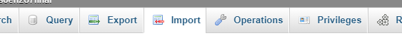

# House of Chef James Mitchell Redesign
Team #12

### How To Set Up the DB
1. Make sure XAMPP is running
2. Open up phpMyAdmin on localhost in your web browser
http://localhost/phpmyadmin/index.php
3. Click on new

4. Name the database: `soen287final`

5. Making sure that it is selected, click on the import tab at the top

6. Let SQL do its stuff and the Database has been created!
